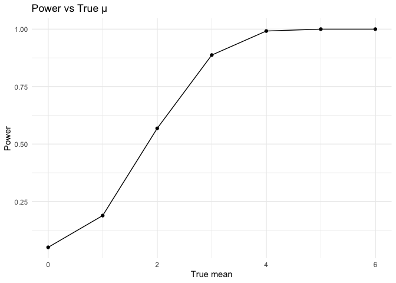
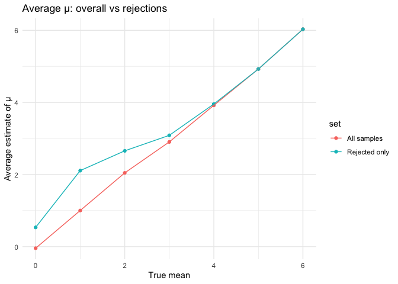
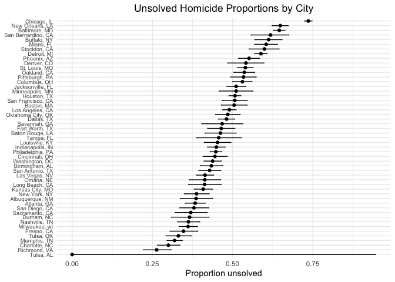

p8105_hw5_xy2719
================
Yao
2025-11-11

Load key packages.

``` r
library(tidyverse)
library(broom)
```

## Problem 1

``` r
birthdays = sample(1:365, 5, replace = TRUE)

repeated_bday = length(unique(birthdays)) < 5

repeated_bday
```

    ## [1] FALSE

Write a function.

``` r
bday_sim = function(n_room) {
  
  birthdays = sample(1:365, n_room, replace = TRUE)

  repeated_bday = length(unique(birthdays)) < n_room

  repeated_bday
  
}

bday_sim(20)
```

    ## [1] TRUE

Run the function 10000 times for each group size between 2 and 50.

``` r
bday_sim_results = 
  expand_grid(
    bdays = 2:50,
    iter = 1:10000
  ) |>
  mutate(
    result = map_lgl(bdays, bday_sim)
  ) |>
  group_by(
    bdays
  ) |>
  summarize(
    prob_repeat = mean(result)
  )
```

Make a plot showing the probability.

``` r
problem1_p =
  bday_sim_results |>
  ggplot(aes(x = bdays, y = prob_repeat)) +
  geom_point() + 
  geom_line() +
  theme_minimal()

problem1_p
```

<!-- -->

Desciption: As group size increases, the probability that at least two
people share a birthday rises rapidly from near 0 and becomes
surprisingly large even for moderate group sizes. Around 20–25 people
the probability is already close to 50%, and by about 40–50 people it is
very close to 1.

``` r
ggsave("figures/problem1_p.jpg", problem1_p)
```

    ## Saving 7 x 5 in image

## Problem 2

``` r
set.seed(1)

# Write function
sim_ttest = function(n_subj, mu = 0, sigma = 5) {
  
  sim_df = 
    tibble(
      x = rnorm(n = n_subj, mean = mu, sd = sigma)
    )
  
  tt_result = t.test(sim_df$x, mu = 0)
  
  tt_result |> 
    broom::tidy() |> 
    summarize(
      mu_true = mu,
      mu_hat = estimate,
      p_value = p.value
    )
}

# Run simulations
sim_results_df = 
  expand_grid(
    mu_true = 0:6,
    iter = 1:5000
  ) |>
  mutate(
    results = map(mu_true, ~ sim_ttest(n_subj = 30, mu = .x, sigma = 5))
  ) |>
  unnest(results, names_sep = "_")
```

``` r
# Plot showing the proportion of times the null was rejected (the power of the test) vs the true value of μ
alpha = 0.05
power_df =
  sim_results_df |> 
  group_by(mu_true) |>
  summarise(power = mean(results_p_value < alpha), .groups = "drop")

problem2_p1 =
  power_df |>
  ggplot(aes(x = mu_true, y = power)) +
  geom_point() +
  geom_line() +
  labs(
    x = "True mean",
    y = "Power",
    title = "Power vs True μ"
  ) +
  theme_minimal()

problem2_p1
```

<!-- -->

Description: Power increases monotonically with the true effect size μ:
as μ moves farther from 0, the test rejects H₀ more often. At μ = 0
power is ~α (≈0.05), and by μ around 5–6 it approaches 1 given n = 30
and σ = 5.

``` r
ggsave("figures/problem2_p1.jpg", problem2_p1)
```

    ## Saving 7 x 5 in image

``` r
# Average μ overall vs among rejections
avg_all =
  sim_results_df |>
  group_by(mu_true) |> 
  summarise(avg_mu_hat = mean(results_mu_hat), .groups = "drop") |>
  mutate(set = "All samples")

avg_rejects =
  sim_results_df |>
  filter(results_p_value < alpha) |>
  group_by(mu_true) |>
  summarise(avg_mu_hat = mean(results_mu_hat), .groups = "drop") |>
  mutate(set = "Rejected only")

avg_both = bind_rows(avg_all, avg_rejects)

problem2_p2 =
  avg_both |>
  ggplot(aes(x = mu_true, y = avg_mu_hat, color = set)) +
  geom_point() +
  geom_line() +
  labs(
    x = "True mean",
    y = "Average estimate of μ",
    title = "Average μ: overall vs rejections"
  ) +
  theme_minimal()

problem2_p2
```

<!-- -->

The sample average of μ across all simulations is approximately equal to
the true μ, showing that the estimator is unbiased. However, the average
μ among only those samples where the null was rejected is biased
upward—it tends to overestimate the true effect because significant
results preferentially come from samples with unusually large observed
means.

``` r
ggsave("figures/problem2_p2.jpg", problem2_p2)
```

    ## Saving 7 x 5 in image

## Problem 3

``` r
# Load local data file
homi_raw =
  readr::read_csv("data/homicide-data.csv") |> view()
```

    ## Rows: 52179 Columns: 12
    ## ── Column specification ────────────────────────────────────────────────────────
    ## Delimiter: ","
    ## chr (9): uid, victim_last, victim_first, victim_race, victim_age, victim_sex...
    ## dbl (3): reported_date, lat, lon
    ## 
    ## ℹ Use `spec()` to retrieve the full column specification for this data.
    ## ℹ Specify the column types or set `show_col_types = FALSE` to quiet this message.

Description of raw data: The data file contains one row per homicide
with identifiers, reported date, victim demographics (name, age, sex,
race), city and state, geolocation, and a disposition indicating case
status (e.g., Closed by arrest, Closed without arrest, Open/No arrest).

``` r
# Create city_state variable and summarise total & unsolved
homi_city =
  homi_raw |>
  mutate(
    city_state = str_c(city, ", ", state),
    unsolved   = disposition %in% c("Closed without arrest", "Open/No arrest")
  ) |>
  group_by(city_state) %>% 
  summarize(
    total    = n(),
    unsolved = sum(unsolved, na.rm = TRUE),
    .groups  = "drop"
  )
```

``` r
# For Baltimore, MD, use prop.test function to estimate unsolved homicides proportion
baltimore =
  homi_city |>
  filter(city_state == "Baltimore, MD")

balt_pt = prop.test(x = baltimore$unsolved, n = baltimore$total)

balt_tidy = broom::tidy(balt_pt)
balt_tidy |> 
  transmute(
    city_state = "Baltimore, MD",
    estimate   = estimate,
    ci_lower   = conf.low,
    ci_upper  = conf.high
  )
```

    ## # A tibble: 1 × 4
    ##   city_state    estimate ci_lower ci_upper
    ##   <chr>            <dbl>    <dbl>    <dbl>
    ## 1 Baltimore, MD    0.646    0.628    0.663

``` r
# prop.test for each of the cities
city_prop_df =
  homi_city |> 
  mutate(
    pt    = map2(unsolved, total, ~ prop.test(.x, .y)),
    tidy  = map(pt, broom::tidy)
  ) |> 
  select(-pt) |> 
  unnest(tidy) |> 
  transmute(
    city_state,
    estimate, 
    conf.low, 
    conf.high,
    total, 
    unsolved
  )
```

    ## Warning: There was 1 warning in `mutate()`.
    ## ℹ In argument: `pt = map2(unsolved, total, ~prop.test(.x, .y))`.
    ## Caused by warning in `prop.test()`:
    ## ! Chi-squared approximation may be incorrect

``` r
# Plot that shows the estimates and CIs for each city
problem3_p =
  city_prop_df |>
  mutate(city_state = fct_reorder(city_state, estimate)) |> 
  ggplot(aes(x = city_state, y = estimate)) +
  geom_point() +
  geom_errorbar(aes(ymin = conf.low, ymax = conf.high), width = 0.2) +
  coord_flip() +
  labs(
    x = NULL,
    y = "Proportion unsolved",
    title = "Unsolved Homicide Proportions by City"
  ) +
  theme_minimal() +
  theme(
    plot.title = element_text(hjust = 0.5),
    axis.text.y  = element_text(size = 7)
    )

problem3_p
```

<!-- -->

``` r
ggsave("figures/problem3_p.jpg", problem3_p, width = 7.5, height = 9, dpi = 300)
```
