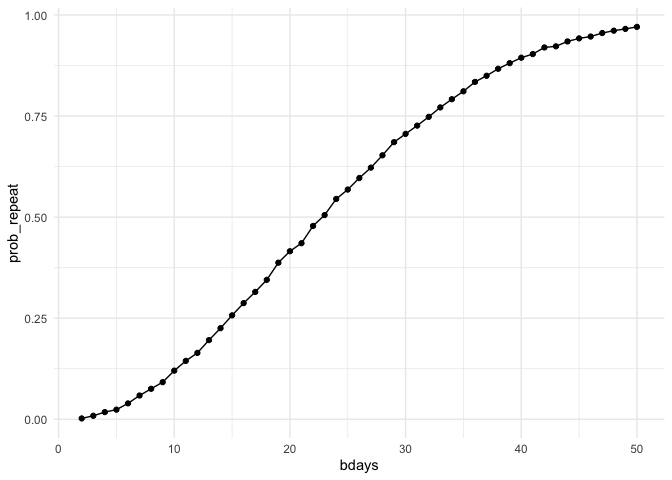

p8105_hw5_xy2719
================
Yao
2025-11-11

``` r
library(tidyverse)
```

## Problem 1

``` r
birthdays = sample(1:365, 5, replace = TRUE)

repeated_bday = length(unique(birthdays)) < 5

repeated_bday
```

    ## [1] FALSE

``` r
# Write a function
bday_sim = function(n_room) {
  
  birthdays = sample(1:365, n_room, replace = TRUE)

  repeated_bday = length(unique(birthdays)) < n_room

  repeated_bday
  
}

bday_sim(20)
```

    ## [1] TRUE

``` r
# Run the function 10000 times for each group size between 2 and 50
bday_sim_results = 
  expand_grid(
    bdays = 2:50,
    iter = 1:10000
  ) |>
  mutate(
    result = map_lgl(bdays, bday_sim)
  ) |>
  group_by(
    bdays
  ) |>
  summarize(
    prob_repeat = mean(result)
  )
```

``` r
# Make a plot showing the probability
bday_sim_results |>
  ggplot(aes(x = bdays, y = prob_repeat)) +
  geom_point() + 
  geom_line()
```

<!-- -->
